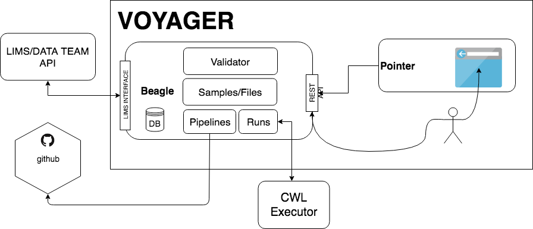

# beagle

Beagle is backend service for managing files, pipelines and runs.

## beagle responsibilities 

- Users
  - Authentication using MSKCC LDAP
  - Every user will have same permissions
- Files
  - List files in Beagle DB
  - Search files (filename, metadata, file-type, file-group)
  - Create File in Beagle DB
- FileMetadata
  - Metadata is associated with file.
  - Metadata versioning. Changes are tracked, and can be reverted.
  - Metadata validation using JsonSchema.
- Pipelines
  - Using pipelines hosted on github
  - Creating RUNs from pipelines
- Run
  - Creating run (choosing pipeline, choosing inputs)
  - Submitting job to rabix executor
  - Receiving updates about job status from rabix
  - List outputs generated from run
- LIMS integration
  - Periodically fetch new samples from LIMS and create File objects in Beagle DB
  - Try to pair fails, and create runs
  - Notify if there are some errors with files or file metadata

## beagle_cli.py

- Command line utility which helps handles authentication and accessing beagle endpoints.

#### setup
- Requirements
  - python 3
  
- Instructions
  - pip install -r requirements-cli.txt
  
- Run  
  - python beagle_cli.py
  

Usage:

  `beagle_cli.py files create <file_path> <file_type> <file_group_id> [--metadata-path=<metadata_path>] [--size=<size>]`
  
  `beagle_cli.py files list [--page-size=<page_size>] [--metadata=<metadata>]... [--file-group=<file_group>]... [--file-name=<file_name>]... [--filename-regex=<filename_regex>]`
  
  `beagle_cli.py storage create <storage_name>`
  
  `beagle_cli.py storage list`
  
  `beagle_cli.py file-types create <file_type>`
  
  `beagle_cli.py file-types list`
  
  `beagle_cli.py --version`
  
 Examples:
- List files by the igoId
  `python beagle_cli.py files list --metadata igoId:07973_BO_6`

## setup

- Requirements
  - PostgreSQL==11
  - RabbitMQ
  - python 3
  
- Instructions
  - virtualenv beagle
  - pip install -r requirements.txt
  - export BEAGLE_DB_NAME=<beagle_db_name>
  - export BEAGLE_DB_USERNAME=<beagle_db_username>
  - export BEAGLE_DB_PASSWORD=<beagle_db_password>
  - export BEAGLE_AUTH_LDAP_SERVER_URI=<ldap_server_uri>
  - export BEAGLE_RABIX_PATH=<rabix_cli_path>
  - export BEAGLE_RABIX_URL=<rabix_url>
  - export BEAGLE_RABBITMQ_USERNAME=<rabbitmq_username>
  - export BEAGLE_RABBITMQ_PASSWORD=<rabbitmq_password>
  - export BEAGLE_RABBITMQ_URL=<rabbitmq_url>
  - python manage.py migrate
  - python manage.py runserver

- Async
  - Celery is used for scheduling tasks related to ETL from LIMS and submission to CWL Executor
  - celery -A beagle_etl beat -l info -f beat.log (starting the periodic task)
  - celery -A beagle_etl worker -l info -f beagle-worker.log (starting the worker)
  - celery -A beagle_etl worker --concurrency 1 -l info -Q beagle_job_scheduler -f scheduler-worker.log
  

Read more detailed specification on [wiki page](https://github.com/mskcc/beagle/wiki/Beagle).